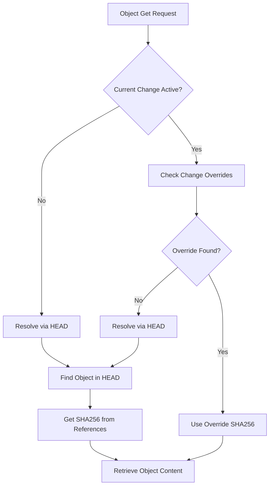

# VCS Worker - Provider Pattern Architecture

A Version Control System (VCS) worker service built with Rust that implements a provider pattern architecture for managing MOO object definitions with Git-like versioning capabilities.

## Table of Contents

- [Architecture Overview](#architecture-overview)
- [Data Model](#data-model)
- [Provider Components](#provider-components)
- [Version Control Flow](#version-control-flow)
- [API Operations](#api-operations)
- [Usage Examples](#usage-examples)
- [Development](#development)

## Architecture Overview

The VCS Worker employs a provider pattern that separates concerns into focused, testable, and maintainable components. Each provider handles a specific aspect of the version control system:

```
┌─────────────────────────────────────────────────────────────┐
│                    Database (Coordinator)                    │
├─────────────────────────────────────────────────────────────────
│  ObjectsProvider  │  RefsProvider  │  HeadProvider  │  ...   |
│  (Content CRUD)   │ (Name→SHA256)  │(Working State) │         │
└─────────────────────────────────────────────────────────────┘
```

### Design Principles

- **Single Responsibility**: Each provider has one focused concern
- **Provider Pattern**: Clean interfaces enable dependency injection and testing
- **Immutable Content**: Objects are stored by SHA256 hash, ensuring content integrity
- **Reference Resolution**: Clean separation between content identity and naming
- **Working State Management**: HEAD provides current working directory semantics

## Data Model

### Objects: Content-Based Storage

Objects are stored using content-based addressing where the SHA256 hash of the object content serves as the primary identifier:

```rust
// Storage: SHA256 → Object Content (MOO dump)
store: HashMap<String, String>
     "a1b2c3...": "ObjectDefinition for MyObject\nend of ObjectDefinition\n"
```

**Key Benefits:**
- **Deduplication**: Identical objects share the same SHA256
- **Integrity**: Content integrity verified by hash
- **Immutability**: Content never changes once stored

### References: Name + Version → SHA256

References provide the mapping from human-readable names to content hashes:

```rust
// Refs Storage: ObjectName → ObjectRef
refs: HashMap<String, ObjectRef> {
    "MyObject": ObjectRef {
        object_name: "MyObject",
        version: 42,
        sha256_key: "a1b2c3..."
    }
}
```

**Version Strategy:**
- **Monotonic Versions**: Each object update increments the version number
- **Latest Tracking**: Refs store the current version for each object name
- **Historical Access**: Full version history through SHA256 references

### HEAD: Working State Management

HEAD represents the current working state of the repository as a collection of specific object versions:

```rust
// HEAD Storage: List of current working references
head: HeadState {
    refs: vec![
        HeadRef { object_name: "MyObject", version: 42 },
        HeadRef { object_name: "OtherObject", version: 7 },
        // ... more working references
    ]
}
```

**Working Directory Semantics:**
- **Current Versions**: HEAD specifies which versions of objects are "checked out"
- **Override Capability**: Current changes can override HEAD for local modifications
- **Branch-like Behavior**: Different states allow for branch-like operations

### Changes: Local State Overrides

Changes provide temporary overrides for HEAD state, enabling local modifications:

```rust
// Change Storage: ChangeId → Change
changes: HashMap<String, Change> {
    "change-123": Change {
        version_overrides: vec![
            ObjectVersionOverride {
                object_name: "MyObject",
                version: 43,
                sha256_key: "x9y8z7..."  // Different from HEAD version
            }
        ],
        deleted_objects: vec!["OldObject"],
        renamed_objects: vec![
            RenamedObject { from: "OldName", to: "NewName" }
        ]
    }
}
```

## Provider Components

### ObjectsProvider: Content Operations

Handles pure CRUD operations for object content.

**Core Operations:**
```rust
trait ObjectsProvider {
    fn store(&self, sha256_key: &str, dump: &str) -> ProviderResult<()>
    fn get(&self, sha256_key: &str) -> ProviderResult<Option<String>>
    fn delete(&self, sha256_key: &str) -> ProviderResult<bool>
    fn generate_sha256_hash(&self, dump: &str) -> String
    fn parse_object_dump(&self, dump: &str) -> ProviderResult<ObjectDefinition>
}
```

**Use Cases:**
- Store new object versions after compilation
- Retrieve object content via SHA256 hash
- Content integrity verification

### RefsProvider: Reference Resolution

Manages object name + version resolution to SHA256 keys.

**Core Operations:**
```rust
trait RefsProvider {
    fn get_ref(&self, object_name: &str) -> ProviderResult<Option<ObjectRef>>
    fn update_ref(&self, object_ref: &ObjectRef) -> ProviderResult<()>
    fn get_next_version(&self, object_name: &str) -> ProviderResult<u64>
    fn resolve_to_sha256(&self, object_name: &str, version: Option<u64>) -> ProviderResult<Option<String>>
}
```

**Name Resolution Flow:**
```
Object Name → Latest Version → SHA256 → Content Retrieval
"MyObject" → version 42 → "a1b2c3..." → Object Content
```

**Specific Version Resolution:**
```
Object Name + Version → SHA256 → Content Retrieval
"MyObject" + version 40 → "x9y8z7..." → Earlier Object Content
```

### HeadProvider: Working State Management

Manages the current working state as a collection of active references.

**Core Operations:**
```rust
trait HeadProvider {
    fn get_head(&self) -> ProviderResult<HeadState>
    fn update_ref(&self, object_name: &str, version: u64) -> ProviderResult<()>
    fn remove_ref(&self, object_name: &str) -> ProviderResult<()>
    fn contains_ref(&self, object_name: &str) -> ProviderResult<bool>
}
```

**Working State Examples:**
- **Checkout Scenario**: HEAD specifies version 42 of MyObject
- **Update Scenario**: Local change updates to version 43
- **Delete Scenario**: Object removed from HEAD entirely

### ChangesProvider: Change Tracking

Handles change creation, metadata, and version overrides.

**Core Operations:**
```rust
trait ChangesProvider {
    fn store_change(&self, change: &Change) -> ProviderResult<()>
    fn get_change(&self, change_id: &str) -> ProviderResult<Option<Change>>
    fn create_blank_change(&self) -> ProviderResult<Change>
    fn get_current_change(&self) -> ProviderResult<Option<Change>>
}
```

**Change Override Priority:**
1. **Current Change Overrides**: Local modifications take precedence
2. **HEAD State**: Base working directory reference
3. **Reference Resolution**: Latest version as fallback

### RepositoryProvider: Metadata Management

Manages repository-level configuration and metadata.

**Core Operations:**
```rust
trait RepositoryProvider {
    fn get_repository(&self) -> ProviderResult<Repository>
    fn set_current_change(&self, change_id: Option<String>) -> ProviderResult<()>
    fn update_metadata(&self, metadata: &RepositoryMetadata) -> ProviderResult<()>
}
```

## Version Control Flow

### Object Update Process

```mermaid
graph TD
    A[Object Update Request] --> B[Parse MOO Object Dump]
    B --> C[Generate SHA256 Hash]
    C --> D[Store Object by SHA256]
    D --> E[Increment Version Number]
    E --> F[Update Object Reference]
    F --> G[Update HEAD Reference]
    G --> H[Create Change Override]
]
```

**Detailed Steps:**

1. **Compilation**: MOO object dump parsed and validated
2. **Hash Generation**: SHA256 computed for content integrity
3. **Content Storage**: Object stored by SHA256 hash (deduplication)
4. **Version Increment**: Next monotonic version for object name
5. **Reference Update**: RefsProvider updates name→version→SHA256 mapping
6. **HEAD Update**: HeadProvider adds/updates working state reference
7. **Change Override**: Current change tracks local modifications

### Object Retrieval Process



**Resolution Priority:**

1. **Change Overrides**: Active change modifications (deletures, renames, versions)
2. **HEAD Resolution**: Current working state reference
3. **Reference Resolution**: Latest version fallback

### Change Management

```mermaid
graph TD
    A[Change Creation] --> B[Generate Change ID]
    B --> C[Initialize Empty Change]
    C --> D[Set as Current Change]
    D --> E[Object Updates Add Overrides]
    E --> F[Object Deletions Tracked]
    F --> G[Renames Tracked]
    G --> H[Change Commitment]
    H --> I[Clear Current Change]
]
```

## API Operations

### Object Operations

#### `object/update`
Stores a new version of an object.

**Request:**
```json
{
    "object_name": "MyObject",
    "vars": [
        "ObjectDefinition for MyObject",
        "  description \"A sample object\"",
        "end of ObjectDefinition"
    ]
}
```

**Flow:** Parse → Hash → Store → Version → Update Refs → Update HEAD → Track Change

#### `object/get`
Retrieves object content respecting current change overrides.

**Request:**
```json
{
    "object_name": "MyObject"
}
```

**Flow:** Check Changes → Resolve HEAD → Fetch References → Retrieve Content

### Change Operations

#### `change/create`
Creates a new change for tracking modifications.

**Request:**
```json
{
    "name": "Fix bug in MyObject",
    "description": "Update object to handle edge cases",
    "author": "developer"
}
```

#### `change/abandon`
Abandons current changes, reverting to HEAD state.

**Request:** Empty body

## Usage Examples

### Basic Object Update
```bash
curl -X POST http://localhost:8080/api/object/update \
  -H "Content-Type: application/json" \
  -d '{
    "object_name": "Player",
    "vars": ["ObjectDefinition for $player", "end of ObjectDefinition"]
  }'
```

### Retrieving Object Version
```bash
curl -X POST http://localhost:8080/api/object/get \
  -H "Content-Type: application/json" \
  -d '{"object_name": "Player"}'
```

### Creating a Change Branch
```bash
# Create change
curl -X POST http://localhost:8080/api/change/create \
  -H "Content-Type: application/json" \
  -d '{
    "name": "Feature Branch",
    "description": "Development branch for new features",
    "author": "developer"
  }'

# Make modifications (automatically tracked in change)
curl -X POST http://localhost:8080/api/object/update \
  -H "Content-Type: application/json" \
  -d '{"object_name": "Player", "vars": ["..."]}'

# Abandon changes to revert to main branch
curl -X POST http://localhost:8080/api/change/abandon
```

## Development

### Project Structure
```
src/
├── main.rs              # Application entry point
├── config.rs            # Configuration management
├── router.rs            # HTTP routing
├── database.rs          # Database coordinator with provider aggregation
├── providers/           # Provider pattern implementations
│   ├── mod.rs          # Provider exports
│   ├── error.rs         # Unified error handling
│   ├── objects.rs       # Content CRUD operations
│   ├── refs.rs          # Reference resolution
│   ├── head.rs          # Working state management
│   ├── changes.rs       # Change tracking
│   └── repository.rs    # Repository metadata
└── operations/          # API operation handlers
    ├── mod.rs
    ├── object_update_op.rs
    ├── object_get_op.rs
    ├── change_create_op.rs
    └── change_abandon_op.rs
```

### Building and Running

```bash
# Build the project
cargo build

# Run in development mode
cargo run

# The service will start on http://localhost:8080
```

### Testing Provider Behavior

Each provider can be tested independently:

```rust
#[cfg(test)]
mod tests {
    use super::*;
    
    #[tokio::test]
    async fn test_objects_provider_crud() {
        let provider = create_test_objects_provider();
        let content = "test object content";
        let hash = provider.generate_sha256_hash(content);
        
        provider.store(&hash, content).await.unwrap();
        let retrieved = provider.get(&hash).await.unwrap().unwrap();
        assert_eq!(content, retrieved);
    }
}
```

### Adding New Providers

To add a new provider:

1. Create provider module in `src/providers/`
2. Implement trait and concrete implementation
3. Update `src/providers/mod.rs` to export
4. Add to Database coordinator
5. Update operations to use new provider

### Configuration

The VCS Worker uses configuration files for database paths and other settings:

```toml
# config.default.toml
[database]
path = "./data/vcs.db"

[server]
host = "localhost"
port = 8080
```

## Conclusion

This provider pattern architecture provides a clean, maintainable foundation for version control operations. The separation of concerns makes the codebase easier to understand, test, and extend while providing Git-like semantics for MOO object management.

Each provider can be developed, tested, and optimized independently, enabling team development and focused expertise in different aspects of the version control system.
