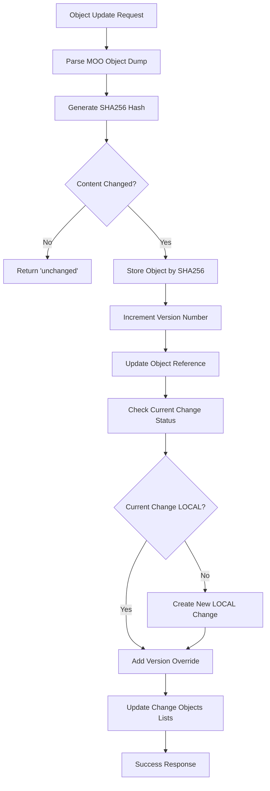
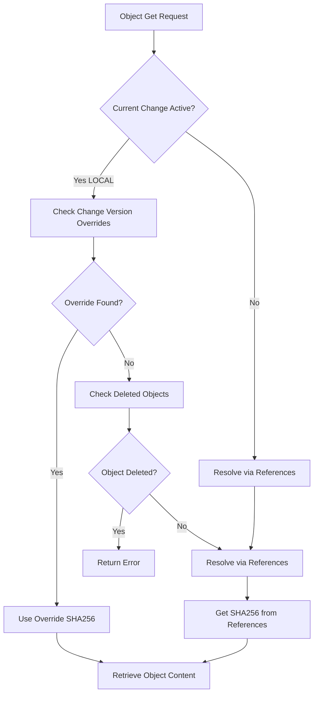

# VCS Worker - Change-Based Architecture

A Version Control System (VCS) worker service built with Rust that implements a change-status-driven architecture for managing MOO object definitions with Git-like versioning capabilities.

## Table of Contents

- [Architecture Overview](#architecture-overview)
- [Data Model](#data-model)
- [Provider Components](#provider-components)
- [Version Control Flow](#version-control-flow)
- [API Operations](#api-operations)
- [Usage Examples](#usage-examples)
- [Development](#development)

## Architecture Overview

The VCS Worker uses a **change-status-driven architecture** where the current working state is represented by the active LOCAL change, eliminating the need for a separate HEAD provider.

```
┌─────────────────────────────────────────────────────────────┐
│                    Database (Coordinator)                    │
├─────────────────────────────────────────────────────────────────
│ ObjectsProvider │ RefsProvider │ ChangesProvider │ IndexProvider │
│ (Content CRUD)  │(Name→SHA256) │(LOCAL/MERGED)   │(Ordering)     │
└─────────────────────────────────────────────────────────────┘
```

### Design Principles

- **Change-Based Workflow**: Current working state = current LOCAL change
- **Status-Driven Design**: Changes have explicit MERGED/LOCAL states
- **Index Management**: Ordered list of changes with current working change at top
- **Provider Pattern**: Clean interfaces enable dependency injection and testing
- **Immutable Content**: Objects stored by SHA256 hash ensuring content integrity
- **Direct Reference Resolution**: Clean separation between content identity and naming

### Key Architectural Changes

**Before (HEAD-based):** Separate HEAD provider tracked current working state
**After (Change-based):** Current LOCAL change represents working state through `version_overrides`

## Data Model

### Objects: Content-Based Storage

Objects are stored using content-based addressing where the SHA256 hash of the object content serves as the primary identifier:

```rust
// Storage: SHA256 → Object Content (MOO dump)
store: HashMap<String, String>
     "a1b2c3...": "ObjectDefinition for MyObject\nend of ObjectDefinition\n"
```

**Key Benefits:**
- **Deduplication**: Identical objects share the same SHA256 (optimization prevents duplicates)
- **Integrity**: Content integrity verified by hash
- **Immutability**: Content never changes once stored

### References: Name + Version → SHA256

References provide the mapping from human-readable names tocontent hashes:

```rust
// Refs Storage: ObjectName → ObjectRef
refs: HashMap<String, ObjectRef> {
    "MyObject": ObjectRef {
        object_name: "MyObject",
        version: 42,
        sha256_key: "a1b2c3..."
    }
}
```

**Version Strategy:**
- **Monotonic Versions**: Each object update increments the version number
- **Latest Tracking**: Refs store the current version for each object name
- **Historical Access**: Full version history through SHA256 references

### Changes: LOCAL vs MERGED States

Changes now have explicit status indicating their state in the workflow:

```rust
#[derive(Debug, Clone)]
pub enum ChangeStatus {
    Local,   // Currently active working change
    Merged,  // Completed and committed changes
}

// Change Storage: ChangeId → Change
changes: HashMap<String, Change> {
    "change-123": Change {
        id: "change-123",
        name: "Fix MyObject",
        status: ChangeStatus::Local,        // Currently working
        version_overrides: vec![           // Local modifications
            ObjectVersionOverride {
                object_name: "MyObject",
                version: 43,
                sha256_key: "x9y8z7..."  // Different from refs version
            }
        ],
        added_objects: vec!["NewObject"],
        modified_objects: vec!["MyObject"],
        deleted_objects: vec!["OldObject"],
        renamed_objects: vec![
            RenamedObject { from: "OldName", to: "NewName" }
        ]
    }
}
```

### Index: Ordered Change Management

The index provider manages change ordering and current working state:

```rust
// Index Storage: Ordered list of change IDs (oldest first, newest last - like a stack)
index: ChangeOrder {
    order: vec!["merged-change-2", "merged-change-1", "local-change"],
    top_change: "local-change"  // Current LOCAL change (last element)
}
```

**Change Ordering:**
- **Stack-Based**: Oldest changes first, newest changes last (like a stack where you push to the end)
- **Top Position**: Current LOCAL change at the end of the list (working state)
- **Chronological Order**: MERGED changes in commit order (oldest to newest)
- **Automatic Management**: Index updates when status changes

## Provider Components

### ObjectsProvider: Content Operations

Handles pure CRUD operations for object content.

**Core Operations:**
```rust
trait ObjectsProvider {
    fn store(&self, sha256_key: &str, dump: &str) -> ProviderResult<()>
    fn get(&self, sha256_key: &str) -> ProviderResult<Option<String>>
    fn delete(&self, sha256_key: &str) -> ProviderResult<bool>
    fn generate_sha256_hash(&self, dump: &str) -> String
    fn parse_object_dump(&self, dump: &str) -> ProviderResult<ObjectDefinition>
}
```

**Optimization:** Skips storage and version increment if SHA256 is identical to current version.

### RefsProvider: Reference Resolution

Manages object name + version resolution to SHA256 keys.

**Core Operations:**
```rust
trait RefsProvider {
    fn get_ref(&self, object_name: &str) -> ProviderResult<Option<ObjectRef>>
    fn update_ref(&self, object_ref: &ObjectRef) -> ProviderResult<()>
    fn get_next_version(&self, object_name: &str) -> ProviderResult<u64>
}
```

**Name Resolution Flow:**
```
Object Name → Latest Version → SHA256 → Content Retrieval
"MyObject" → version 42 → "a1b2c3..." → Object Content
```

### ChangesProvider: Change Tracking with Status

Handles change creation and tracks LOCAL vs MERGED states.

**Core Operations:**
```rust
trait ChangesProvider {
    fn store_change(&self, change: &Change) -> ProviderResult<()>
    fn get_change(&self, change_id: &str) -> ProviderResult<Option<Change>>
    fn update_change(&self, change: &Change) -> ProviderResult<()>
    fn create_blank_change(&self) -> ProviderResult<Change>
}
```

**Change Status Workflow:**
1. **Create Change**: Set status to LOCAL (becomes working state)
2. **Development**: Object updates add version_overrides to LOCAL change
3. **Commit**: Change status transitions to MERGED
4. **New Working State**: Index provider promotes new LOCAL change or creates blank one

### IndexProvider: Working State Management

Replaces HEAD provider by managing ordered changes and current working state.

**Core Operations:**
```rust
trait IndexProvider {
    fn push_change(&self, change_id: &str) -> ProviderResult<()>     // Push to top of stack (end, newest)
    fn get_change_order(&self) -> ProviderResult<Vec<String>>        // Get ordered list (oldest first)
    fn get_top_change(&self) -> ProviderResult<Option<String>>       // Get current LOCAL change (last element)
    fn remove_from_index(&self, change_id: &str) -> ProviderResult<()>  // Remove from working set (not from storage)
}
```

**Working State Management:**
- **Current Working**: Last change (top of stack) with LOCAL status represents working state
- **Stack-Based Ordering**: Oldest first, newest last - new changes pushed to the end
- **Automatic Promotion**: When LOCAL change becomes MERGED, next LOCAL change becomes top
- **Blank Change Creation**: No valid LOCAL change at top triggers blank change creation

### RepositoryProvider: Metadata Management

**Core Operations:**
```rust
trait RepositoryProvider {
    fn get_repository(&self) -> ProviderResult<Repository>
    fn set_repository(&self, repo: &Repository) -> ProviderResult<()>
}
```

## Version Control Flow

### Object Update Process (New Architecture)



**Detailed Steps:**

1. **Compilation**: MOO object dump parsed and validated
2. **Hash Generation**: SHA256 computed for content integrity
3. **Duplicate Check**: Skip processing if content unchanged (optimization)
4. **Content Storage**: Object stored by SHA256 hash (deduplication)
5. **Version Increment**: Next monotonic version for object name
6. **Reference Update**: RefsProvider updates name→version→SHA256 mapping
7. **Change Status Check**: Verify current change is LOCAL
8. **Change Creation**: Create new LOCAL change if current change is MERGED
9. **Version Override**: Add override to current LOCAL change
10. **Status Tracking**: Update added/modified lists based on object existence

### Object Retrieval Process (Simplified)



**Resolution Priority:**

1. **Change Overrides**: Active LOCAL change modifications (versions, deletions, renames)
2. **Reference Resolution**: Latest version from refs provider
3. **Error Handling**: Deleted objects return "not found" error

### Change Management Workflow

```mermaid
graph TD
    A[Change Creation] --> B[Set Status to LOCAL]
    B --> C[Add to Index End (Stack Push)]
    C --> D[Object Updates Track Overrides]
    D --> E[Change Status Check]
    E --> F{Status = LOCAL?}
    F -->|Yes| G[Continue Working]
    F -->|No MERGED| H[Create New LOCAL Change]
    H --> I[Set as New Working State]
    G --> J[Development Continues]
    J --> K[Commit Change]
    K --> L[Set Status to MERGED]
    L --> M[Remains in Index Order]
    M --> N[Promote Next LOCAL Change]
```

## API Operations

### Object Operations

#### `object/update`
Stores a new version of an object, automatically managing LOCAL vs MERGED change states.

**Request:**
```json
{
    "object_name": "MyObject",
    "vars": [
        "ObjectDefinition for MyObject",
        "  description \"A sample object\"",
        "end of ObjectDefinition"
    ]
}
```

**Enhanced Flow:** Parse → Hash → Duplicate Check → Store → Version → Update Refs → Check Change Status → Add Override → Track Added/Modified

**Response:** `"Object 'MyObject' updated successfully with version 42"` or `"Object 'MyObject' unchanged (no modifications)"`

#### `object/get`
Retrieves object content respecting current LOCAL change overrides.

**Request:**
```json
{
    "object_name": "MyObject"
}
```

**Simplified Flow:** Check LOCAL Change → Overrides → Deleted Check → References → Content

#### `object/list` (NEW)
Lists all objects by walking through the entire change history chronologically, tracking renames, additions, and deletions.

**Request:**
```json
{}
```

**Response:**
```json
{
    "objects": [
        {"name": "object1", "version": 3},
        {"name": "object2", "version": 1}
    ]
}
```

**How It Works:**
1. Retrieves all changes in chronological order (oldest first)
2. Processes each change sequentially:
   - **Deletions**: Removes objects from tracking
   - **Renames**: Updates object names (e.g., `foo` → `baz`)
   - **Additions**: Adds new objects with version 1
   - **Modifications**: Increments version numbers
3. Returns final list of object names with current versions

**Example Scenario:**
- Change 0: Add `foo` and `bar`
- Change 1: Rename `foo` → `baz`
- Change 3: Delete `bar`
- **Result**: Only `baz` (version 1) appears in final list

### Change Operations

#### `change/create`
Creates a new LOCAL change for tracking modifications.

**Request:**
```json
{
    "name": "Fix bug in MyObject",
    "description": "Update object to handle edge cases",
    "author": "developer"
}
```

**Response:** `"Created change 'Fix bug in MyObject' with ID: abc-123-def"`

#### `change/abandon`
Abandons current changes, clearing the working state.

**Request:** Empty body

**Response:** `"Abandoned change 'change-id'"` or `"No current change to abandon"`

#### `change/status` (NEW)
Lists all objects modified in the current change.

**Request:** Empty body

**Response:**
```json
{
  "change_id": "abc-123-def", 
  "change_name": "Fix bug in MyObject",
  "added": ["new_object"],
  "modified": ["MyObject", "OtherObject"],
  "deleted": ["old_object"],
  "renamed": [
    {"from": "old_name", "to": "new_name"}
  ]
}
```

## Usage Examples

### Basic Object Update
```bash
curl -X POST http://localhost:8080/api/object/update \
  -H "Content-Type: application/json" \
  -d '{
    "object_name": "Player",
    "vars": ["ObjectDefinition for $player", "end of ObjectDefinition"]
  }'
```

### Retrieving Object Version
```bash
curl -X POST http://localhost:8080/api/object/get \
  -H "Content-Type: application/json" \
  -d '{"object_name": "Player"}'
```

### Creating a Change Branch
```bash
# Create LOCAL change (becomes working state)
curl -X POST http://localhost:8080/api/change/create \
  -H "Content-Type: application/json" \
  -d '{
    "name": "Feature Branch",
    "description": "Development branch for new features", 
    "author": "developer"
  }'

# Make modifications (automatically tracked in LOCAL change)
curl -X POST http://localhost:8080/api/object/update \
  -H "Content-Type: application/json" \
  -d '{"object_name": "Player", "vars": ["..."]}'

# Check change status
curl -X GET http://localhost:8080/api/change/status

# Abandon changes to revert to previous state
curl -X POST http://localhost:8080/api/change/abandon
```

## Development

### Project Structure
```
src/
├── main.rs              # Application entry point
├── config.rs            # Configuration management
├── router.rs            # HTTP routing
├── util.rs              # Utility functions (time stamps, etc.)
├── database.rs          # Database coordinator with provider aggregation
├── providers/           # Provider pattern implementations
│   ├── mod.rs          # Provider exports and architecture docs
│   ├── error.rs         # Unified error handling
│   ├── objects.rs       # Content CRUD operations
│   ├── refs.rs          # Reference resolution
│   ├── changes.rs       # Change tracking with status
│   ├── index.rs         # Ordered change management (replaces HEAD)
│   │                   #   - DRY helper methods for serialization
│   │                   #   - ChangeOperationProcessor for object list computation
│   └── repository.rs    # Repository metadata
└── operations/          # API operation handlers
    ├── mod.rs
    ├── object/
    │   ├── object_update_op.rs
    │   ├── object_get_op.rs
    │   ├── object_rename_op.rs  # Object renaming operations
    │   ├── object_delete_op.rs  # Object deletion operations
    │   └── object_list_op.rs    # Complete object list computation
    └── change/
        ├── change_create_op.rs
        ├── change_abandon_op.rs
        └── change_status_op.rs
```

### Building and Running

```bash
# Build the project
cargo build

# Run in development mode
cargo run

# The service will start on http://localhost:8080
```

### Key Architectural Benefits

**Simplified Data Flow:**
- Eliminated HEAD provider redundancy
- Current LOCAL change represents working state directly
- Index provider manages change ordering automatically

**Performance Optimizations:**
- Duplicate content detection prevents unnecessary storage
- Direct refs access eliminates HEAD indirection
- SHA256-based content integrity checking

**Cleaner Architecture:**
- Single source of truth for working state
- Explicit change status management
- Provider isolation for testing and development

### Configuration

The VCS Worker uses configuration files for database paths and other settings:

```toml
# config.default.toml
[database]
path = "./data/vcs.db"

[server]
host = "localhost"
port = 8080
```

## Summary

This change-status-driven architecture provides a cleaner, more efficient version control system by:

1. **Eliminating Redundancy**: Removing HEAD provider in favor of current LOCAL change
2. **Explicit Status Management**: MERGED/LOCAL states provide clear workflow semantics
3. **Automatic Ordering**: Index provider manages change chronology and working state
4. **Performance Optimization**: Duplicate content detection and direct refs access
5. **Simplified Logic**: Object retrieval checks LOCAL change overrides first, then refs

The provider pattern maintains clean separation of concerns while the change-status system provides Git-like semantics optimized for MOO object development workflows.